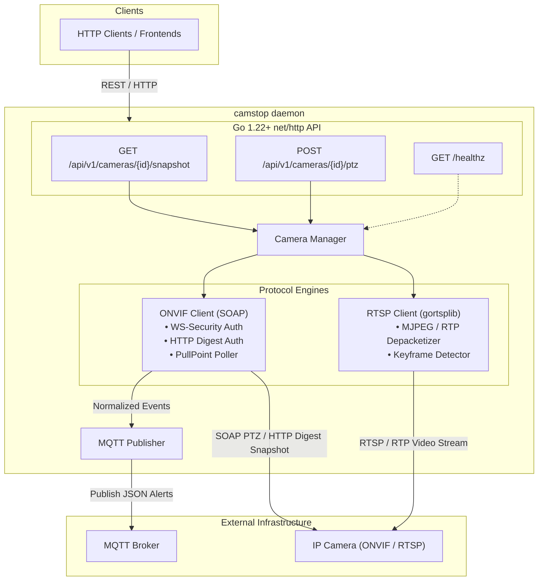

# camstop

`camstop` is a lightweight (< 20MB RSS), single-binary edge daemon written in pure Go. It bridges IP cameras to modern edge computing environments by providing:

1. **On-Demand Snapshots**: Connects to the camera on-demand (via ONVIF HTTP or RTSP), grabs a frame, converts it to JPEG in memory, and serves it over HTTP. Zero 24/7 decoding overhead.
2. **PTZ Control**: Exposes simple JSON REST endpoints for continuous velocity moves, absolute stops, and preset recalls via ONVIF SOAP.
3. **ONVIF Event-to-MQTT Bridge**: Subscribes to camera PullPoint notification queues (motion, tamper, line crossing), normalizes states, and publishes clean JSON events to MQTT.
4. **Zero Heavy Dependencies**: Pure Go compilation (`CGO_ENABLED=0`) with built-in H.264 snapshot extraction via external decoder or pure Go MJPEG.

---

## Architecture Overview



### Memory Footprint & Resource Strategy
- **Idle State**: ~10–15MB RSS. Only small background goroutines for MQTT keep-alives and ONVIF PullPoint long-polling.
- **Snapshot Request**: Ephemeral connection opened, JPEG downloaded or RTP depacketized, memory garbage-collected immediately. No continuous video decoders or frame ring buffers kept in RAM.

---

## Network Camera Discovery (`--scan`)

`camstop` can automatically scan your local network interfaces for ONVIF cameras (via WS-Discovery multicast `239.255.255.250:3702`) and active RTSP video streams (port 554/8554 sweep):

```bash
# Scan local network
./camstop --scan

# Scan with custom timeout
./camstop --scan --scan-timeout 2s

# Scan and generate ready-to-use YAML configuration block
./camstop --scan --generate-config >> camstop.yaml
```

**Example Output:**
```text
Scanning local network for ONVIF and RTSP cameras (timeout: 3s)...

IP ADDRESS       TYPE       MANUFACTURER   MODEL / NAME           RTSP / ONVIF ENDPOINT
------------------------------------------------------------------------------------------------
192.168.1.12     ONVIF+RTSP -              C216                   rtsp://192.168.1.12:554/live
192.168.1.113    ONVIF      -              C720                   http://192.168.1.113:2020/onvif...
------------------------------------------------------------------------------------------------
Discovered 2 camera(s) on local network.
```

---

## Interactive Camera Manager (TUI)

Launch a full terminal user interface to browse detected cameras, inspect live details, configure credentials, test connections, and save changes:

```bash
# Launch interactive TUI
./camstop --tui

# Or via make
make tui
```

```text
 CAMSTOP CAMERA MANAGER   Config: camstop.yaml

  [1. Configured (2)]   2. Discovered (2)   [Tab] switch view

    CAMERA ID            NAME                     ONVIF ADDRESS          SNAPSHOT
    ────────────────────────────────────────────────────────────────────────────────
  ▶ front_door           Front Porch Tapo C216    192.168.1.12:2020      auto
    driveway             Driveway PTZ             192.168.1.113:2020     auto


  ● Press 's' to scan network, 'a' to add, 'e' to edit, 'w' to save, 'q' to quit
  [s] Scan LAN  [a] Add  [e/Enter] Edit  [d] Delete  [t] Test  [w] Write File  [q] Quit
```

### TUI Keybindings:
- **`[Tab]`**: Switch between **Configured** and **Discovered** cameras.
- **`[s]`**: Broadcast network WS-Discovery & RTSP sweep to find nearby cameras.
- **`[a]`**: Add camera (pre-populates with highlighted camera details when on Discovered tab).
- **`[e]` / `[Enter]`**: Edit highlighted camera credentials, endpoints, and event options.
- **`[d]`**: Delete selected camera from configuration.
- **`[t]`**: Test live camera connectivity and snapshot capture.
- **`[w]`**: Save/write updated configuration directly to `camstop.yaml`.
- **`[q]` / `[Ctrl+C]`**: Quit TUI.

---

## Quick Start

### 1. Build
```bash
make build
```

Cross-compile for edge gateways (e.g., Raspberry Pi 4/5):
```bash
make build-linux-arm64
```

### 2. Auto-Discover or Configure
Auto-generate configuration from discovered cameras:
```bash
./camstop --scan --generate-config > camstop.yaml
```
Or copy [config.example.yaml](file:///Users/asc/git/camstop/config.example.yaml):
```bash
cp config.example.yaml camstop.yaml
```

### 3. Run
```bash
./camstop -config camstop.yaml -log-level debug
```

---

## API Reference

### 1. Health & Status
```http
GET /healthz
```
Response:
```json
{
  "camera_count": 2,
  "status": "ok",
  "uptime": "12m34s"
}
```

### 2. List Configured Cameras
```http
GET /api/v1/cameras
```

### 3. On-Demand Snapshot
```http
GET /api/v1/cameras/{id}/snapshot
```
Returns: Binary JPEG image (`Content-Type: image/jpeg`) with cache-busting headers.

### 4. PTZ Control
```http
POST /api/v1/cameras/{id}/ptz
Content-Type: application/json
```

**Move (Continuous velocity):**
```json
{
  "action": "move",
  "pan": 0.5,
  "tilt": -0.2,
  "zoom": 0.0
}
```

**Stop:**
```json
{
  "action": "stop"
}
```

**Recall Preset:**
```json
{
  "action": "preset",
  "preset_token": "1"
}
```

---

## MQTT Event Bridge

When `pull_events: true` is enabled on a camera, `camstop` subscribes to the camera's ONVIF PullPoint notification queue. Detected alerts are normalized and published to:

`<topic_prefix>/<camera_id>/<event_type>` (e.g. `camstop/events/front_door/motion`)

Payload format:
```json
{
  "camera_id": "front_door",
  "type": "motion",
  "state": true,
  "raw_topic": "tns1:RuleEngine/CellMotionDetector/Motion",
  "timestamp": "2026-10-01T22:45:00.123Z"
}
```

---

## Docker Deployment

`camstop` provides official multi-architecture Docker images (`linux/amd64` and `linux/arm64`) with `ffmpeg` and `ca-certificates` pre-installed for seamless H.264/H.265 RTSP snapshot extraction.

### 1. Run with Docker CLI
```bash
docker run -d \
  --name camstop \
  --restart unless-stopped \
  --network host \
  -v $(pwd)/camstop.yaml:/etc/camstop/camstop.yaml:ro \
  ghcr.io/smford/camstop:latest
```

> [!NOTE]
> **Why `--network host`?**
> Local camera discovery (`--scan`) relies on ONVIF WS-Discovery (multicast UDP `239.255.255.250:3702`). Docker bridge networks do not forward UDP multicast broadcasts across the host's physical network adapter. If you do not need auto-discovery and configure cameras directly by IP, you can use standard port mapping instead (`-p 8080:8080`).

### 2. Run with Docker Compose
A [`docker-compose.yml`](docker-compose.yml) is included in the repository:

```yaml
services:
  camstop:
    image: ghcr.io/smford/camstop:latest
    container_name: camstop
    restart: unless-stopped
    network_mode: host
    volumes:
      - ./camstop.yaml:/etc/camstop/camstop.yaml:ro
    environment:
      - TZ=UTC
```

Start the container:
```bash
docker compose up -d
```

### 3. Build Docker Image Locally
```bash
# Using Make
make docker-build

# Or using Docker directly
docker build -t camstop:latest .
```

---

## Releases & SemVer Versioning

Releases follow standard Semantic Versioning (`vMAJOR.MINOR.PATCH`).

### Automated CI/CD & Multi-Arch Docker Publishing
Whenever a Git tag matching `v*.*.*` is pushed to GitHub, the `.github/workflows/release.yml` workflow triggers [GoReleaser](https://goreleaser.com/) to automatically build and publish:

1. **Static Binary Archives**:
   - `linux/amd64`
   - `linux/arm64` (Raspberry Pi 3/4/5, Armbian, edge appliances)
   - `darwin/amd64` (Intel Mac)
   - `darwin/arm64` (Apple Silicon)
   - Accompanying SHA256 checksums attached to the GitHub Release.

2. **Multi-Architecture Container Images**:
   - Pushed directly to GitHub Container Registry (`ghcr.io`):
     - `ghcr.io/smford/camstop:latest`
     - `ghcr.io/smford/camstop:vX.Y.Z`
     - `ghcr.io/smford/camstop:vX.Y`
     - `ghcr.io/smford/camstop:vX`
   - Supporting both `linux/amd64` and `linux/arm64`.

### Creating a Release
Use the built-in Makefile targets:
```bash
# Bump patch (v0.1.0 -> v0.1.1)
make tag-patch
git push origin v0.1.1

# Or bump minor (v0.1.0 -> v0.2.0)
make tag-minor
git push origin v0.2.0
```