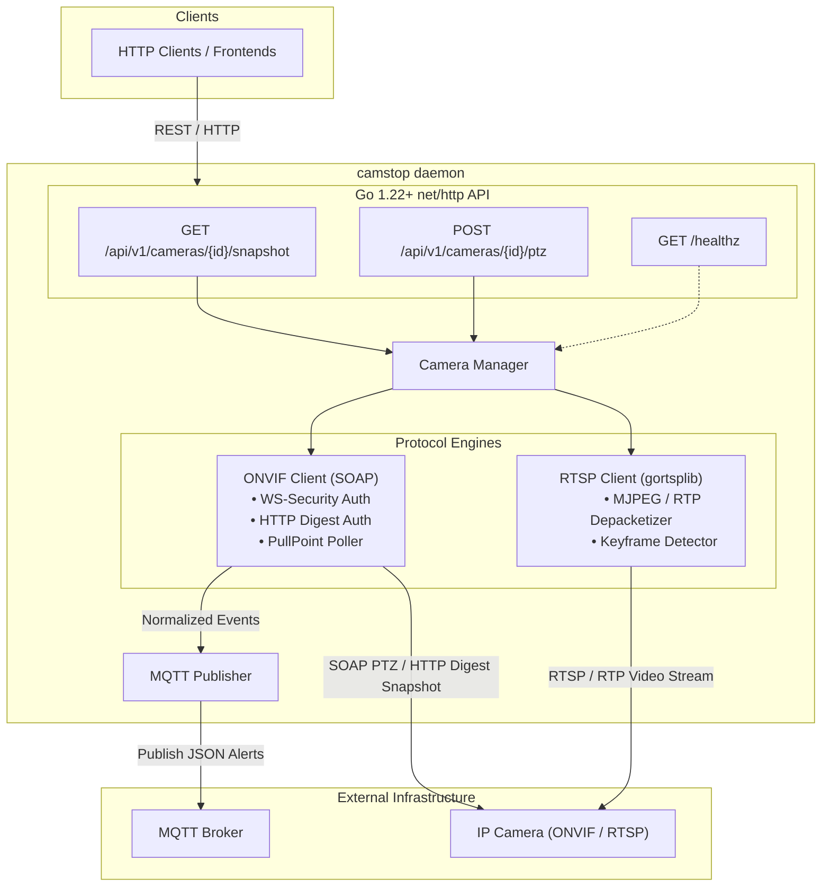

# camstop

`camstop` is a lightweight (< 20MB RSS), single-binary edge daemon written in pure Go. It bridges IP cameras to modern edge computing environments by providing:

1. **On-Demand Snapshots**: Connects to the camera on-demand (via ONVIF HTTP or RTSP), grabs a frame, converts it to JPEG in memory, and serves it over HTTP. Zero 24/7 decoding overhead.
2. **PTZ Control**: Exposes simple JSON REST endpoints for continuous velocity moves, absolute stops, and preset recalls via ONVIF SOAP.
3. **ONVIF Event-to-MQTT Bridge**: Subscribes to camera PullPoint notification queues (motion, tamper, line crossing), normalizes states, and publishes clean JSON events to MQTT.
4. **Zero Heavy Dependencies**: Pure Go compilation (`CGO_ENABLED=0`) with built-in H.264 snapshot extraction via external decoder or pure Go MJPEG.

---

## Architecture Overview



### Memory Footprint & Resource Strategy
- **Idle State**: ~10–15MB RSS. Only small background goroutines for MQTT keep-alives and ONVIF PullPoint long-polling.
- **Snapshot Request**: Ephemeral connection opened, JPEG downloaded or RTP depacketized, memory garbage-collected immediately. No continuous video decoders or frame ring buffers kept in RAM.

---

## Network Camera Discovery (`--scan`)

`camstop` can automatically scan your local network interfaces for ONVIF cameras (via WS-Discovery multicast `239.255.255.250:3702`) and active RTSP video streams (port 554/8554 sweep):

```bash
# Scan local network
./camstop --scan

# Scan with custom timeout
./camstop --scan --scan-timeout 2s

# Scan and generate ready-to-use YAML configuration block
./camstop --scan --generate-config >> camstop.yaml
```

**Example Output:**
```text
Scanning local network for ONVIF and RTSP cameras (timeout: 3s)...

IP ADDRESS       TYPE       MANUFACTURER   MODEL / NAME           RTSP / ONVIF ENDPOINT
------------------------------------------------------------------------------------------------
192.168.1.12     ONVIF+RTSP -              C216                   rtsp://192.168.1.12:554/live
192.168.1.113    ONVIF      -              C720                   http://192.168.1.113:2020/onvif...
------------------------------------------------------------------------------------------------
Discovered 2 camera(s) on local network.
```

---

## Interactive Camera Manager (TUI)

Launch a full terminal user interface to browse detected cameras, inspect live details, configure credentials, test connections, and save changes:

```bash
# Launch interactive TUI
./camstop --tui

# Or via make
make tui
```

```text
 CAMSTOP CAMERA MANAGER   Config: camstop.yaml

  [1. Configured (2)]   2. Discovered (2)   [Tab] switch view

    CAMERA ID            NAME                     ONVIF ADDRESS          SNAPSHOT
    ────────────────────────────────────────────────────────────────────────────────
  ▶ front_door           Front Porch Tapo C216    192.168.1.12:2020      auto
    driveway             Driveway PTZ             192.168.1.113:2020     auto


  ● Press 's' to scan network, 'a' to add, 'e' to edit, 'w' to save, 'q' to quit
  [s] Scan LAN  [a] Add  [e/Enter] Edit  [d] Delete  [t] Test  [w] Write File  [q] Quit
```

### TUI Keybindings:
- **`[Tab]`**: Switch between **Configured** and **Discovered** cameras.
- **`[s]`**: Broadcast network WS-Discovery & RTSP sweep to find nearby cameras.
- **`[a]`**: Add camera (pre-populates with highlighted camera details when on Discovered tab).
- **`[e]` / `[Enter]`**: Edit highlighted camera credentials, endpoints, and event options.
- **`[d]`**: Delete selected camera from configuration.
- **`[t]`**: Test live camera connectivity and snapshot capture.
- **`[w]`**: Save/write updated configuration directly to `camstop.yaml`.
- **`[q]` / `[Ctrl+C]`**: Quit TUI.

---

## Quick Start

### 1. Build
```bash
make build
```

Cross-compile for edge gateways (e.g., Raspberry Pi 4/5):
```bash
make build-linux-arm64
```

### 2. Auto-Discover or Configure
Auto-generate configuration from discovered cameras:
```bash
./camstop --scan --generate-config > camstop.yaml
```
Or copy [config.example.yaml](file:///Users/asc/git/camstop/config.example.yaml):
```bash
cp config.example.yaml camstop.yaml
```

### 3. Run
```bash
./camstop -config camstop.yaml -log-level debug
```

---

## API Reference & Examples (`curl` & `wget`)

All endpoints are available over HTTP on port `8080` (or your configured port).

### 1. Health & System Status (`GET /healthz`)
Inspect daemon health, process uptime, and the number of active cameras.

- **curl**:
  ```bash
  curl -s http://localhost:8080/healthz | jq
  ```
- **wget**:
  ```bash
  wget -q -O- http://localhost:8080/healthz
  ```
- **Response**:
  ```json
  {
    "camera_count": 3,
    "status": "ok",
    "uptime": "15m42s"
  }
  ```

---

### 2. List Configured Cameras (`GET /api/v1/cameras`)
Retrieve metadata, ONVIF addresses, and configuration flags for all cameras.

- **curl**:
  ```bash
  curl -s http://localhost:8080/api/v1/cameras | jq
  ```
- **wget**:
  ```bash
  wget -q -O- http://localhost:8080/api/v1/cameras
  ```
- **Response**:
  ```json
  [
    {
      "id": "camera1",
      "name": "Front Porch C216",
      "address": "192.168.1.160:2020",
      "snapshot_method": "auto",
      "events_enabled": false
    },
    {
      "id": "tort1",
      "name": "Tortoise Terrarium",
      "address": "192.168.1.12:2020",
      "snapshot_method": "auto",
      "events_enabled": false
    }
  ]
  ```

---

### 3. Capture On-Demand Snapshot (`GET /api/v1/cameras/{id}/snapshot`)
Grabs a fresh keyframe on demand and serves it directly as a standard binary JPEG (`image/jpeg`).

- **curl**:
  ```bash
  # Download to snapshot.jpg
  curl -s -o snapshot.jpg http://localhost:8080/api/v1/cameras/camera1/snapshot

  # Save with timestamp in filename
  curl -s -o "camera1_$(date +%Y%m%d_%H%M%S).jpg" http://localhost:8080/api/v1/cameras/camera1/snapshot
  ```
- **wget**:
  ```bash
  # Download to snapshot.jpg
  wget -O snapshot.jpg http://localhost:8080/api/v1/cameras/camera1/snapshot

  # Quiet download with timestamp in filename
  wget -q -O "camera1_$(date +%Y%m%d_%H%M%S).jpg" http://localhost:8080/api/v1/cameras/camera1/snapshot
  ```

---

### 4. PTZ Control (`POST /api/v1/cameras/{id}/ptz`)
Send continuous velocity move vectors, halts, or preset recalls to motorized ONVIF Profile S cameras.

#### A. Continuous Move (Pan, Tilt, Zoom)
Velocity coordinates range from `-1.0` to `1.0`:
- `pan`: `-1.0` (max speed left) to `1.0` (max speed right)
- `tilt`: `-1.0` (max speed down) to `1.0` (max speed up)
- `zoom`: `-1.0` (zoom out) to `1.0` (zoom in)

**Move Left and Up:**
- **curl**:
  ```bash
  curl -s -X POST http://localhost:8080/api/v1/cameras/camera1/ptz \
    -H "Content-Type: application/json" \
    -d '{"action":"move","pan":-0.5,"tilt":0.5}'
  ```
- **wget**:
  ```bash
  wget --header="Content-Type: application/json" \
    --post-data='{"action":"move","pan":-0.5,"tilt":0.5}' \
    -q -O- http://localhost:8080/api/v1/cameras/camera1/ptz
  ```

**Pan Right:**
- **curl**:
  ```bash
  curl -s -X POST http://localhost:8080/api/v1/cameras/camera1/ptz \
    -H "Content-Type: application/json" \
    -d '{"action":"move","pan":0.5,"tilt":0.0}'
  ```
- **wget**:
  ```bash
  wget --header="Content-Type: application/json" \
    --post-data='{"action":"move","pan":0.5,"tilt":0.0}' \
    -q -O- http://localhost:8080/api/v1/cameras/camera1/ptz
  ```

**Tilt Down:**
- **curl**:
  ```bash
  curl -s -X POST http://localhost:8080/api/v1/cameras/camera1/ptz \
    -H "Content-Type: application/json" \
    -d '{"action":"move","pan":0.0,"tilt":-0.5}'
  ```
- **wget**:
  ```bash
  wget --header="Content-Type: application/json" \
    --post-data='{"action":"move","pan":0.0,"tilt":-0.5}' \
    -q -O- http://localhost:8080/api/v1/cameras/camera1/ptz
  ```

**Zoom In:**
- **curl**:
  ```bash
  curl -s -X POST http://localhost:8080/api/v1/cameras/camera1/ptz \
    -H "Content-Type: application/json" \
    -d '{"action":"move","zoom":0.5}'
  ```
- **wget**:
  ```bash
  wget --header="Content-Type: application/json" \
    --post-data='{"action":"move","zoom":0.5}' \
    -q -O- http://localhost:8080/api/v1/cameras/camera1/ptz
  ```

#### B. Stop Motion
Halts ongoing pan, tilt, or zoom motors immediately.

- **curl**:
  ```bash
  curl -s -X POST http://localhost:8080/api/v1/cameras/camera1/ptz \
    -H "Content-Type: application/json" \
    -d '{"action":"stop"}'
  ```
- **wget**:
  ```bash
  wget --header="Content-Type: application/json" \
    --post-data='{"action":"stop"}' \
    -q -O- http://localhost:8080/api/v1/cameras/camera1/ptz
  ```

#### C. Recall Preset Position
Moves the camera to a saved ONVIF viewpoint / preset token.

- **curl**:
  ```bash
  curl -s -X POST http://localhost:8080/api/v1/cameras/camera1/ptz \
    -H "Content-Type: application/json" \
    -d '{"action":"preset","preset_token":"1"}'
  ```
- **wget**:
  ```bash
  wget --header="Content-Type: application/json" \
    --post-data='{"action":"preset","preset_token":"1"}' \
    -q -O- http://localhost:8080/api/v1/cameras/camera1/ptz
  ```

---

### 5. Shell Scripting & Automation Examples

#### Nudge Camera: Move for 1 Second, Then Stop
- **With curl**:
  ```bash
  # Start moving right
  curl -s -X POST http://localhost:8080/api/v1/cameras/camera1/ptz \
    -H "Content-Type: application/json" \
    -d '{"action":"move","pan":0.5}'
  
  # Wait 1 second
  sleep 1
  
  # Stop moving
  curl -s -X POST http://localhost:8080/api/v1/cameras/camera1/ptz \
    -H "Content-Type: application/json" \
    -d '{"action":"stop"}'
  ```

- **With wget**:
  ```bash
  # Start moving right
  wget --header="Content-Type: application/json" \
    --post-data='{"action":"move","pan":0.5}' \
    -q -O- http://localhost:8080/api/v1/cameras/camera1/ptz
  
  # Wait 1 second
  sleep 1
  
  # Stop moving
  wget --header="Content-Type: application/json" \
    --post-data='{"action":"stop"}' \
    -q -O- http://localhost:8080/api/v1/cameras/camera1/ptz
  ```

#### Periodic Snapshot Timelapse Loop (every 10 seconds)
```bash
while true; do
  curl -s -o "frame_$(date +%Y%m%d_%H%M%S).jpg" http://localhost:8080/api/v1/cameras/camera1/snapshot
  sleep 10
done
```

---

## MQTT Event Bridge

When `pull_events: true` is enabled on a camera, `camstop` subscribes to the camera's ONVIF PullPoint notification queue. Detected alerts are normalized and published to:

`<topic_prefix>/<camera_id>/<event_type>` (e.g. `camstop/events/front_door/motion`)

Payload format:
```json
{
  "camera_id": "front_door",
  "type": "motion",
  "state": true,
  "raw_topic": "tns1:RuleEngine/CellMotionDetector/Motion",
  "timestamp": "2026-10-01T22:45:00.123Z"
}
```

---

## Docker Deployment

`camstop` provides official multi-architecture Docker images (`linux/amd64` and `linux/arm64`) with `ffmpeg` and `ca-certificates` pre-installed for seamless H.264/H.265 RTSP snapshot extraction.

### 1. Run with Docker CLI
```bash
docker run -d \
  --name camstop \
  --restart unless-stopped \
  --network host \
  -v $(pwd)/camstop.yaml:/etc/camstop/camstop.yaml:ro \
  ghcr.io/smford/camstop:latest
```

> [!NOTE]
> **Why `--network host`?**
> Local camera discovery (`--scan`) relies on ONVIF WS-Discovery (multicast UDP `239.255.255.250:3702`). Docker bridge networks do not forward UDP multicast broadcasts across the host's physical network adapter. If you do not need auto-discovery and configure cameras directly by IP, you can use standard port mapping instead (`-p 8080:8080`).

### 2. Run with Docker Compose
A [`docker-compose.yml`](docker-compose.yml) is included in the repository:

```yaml
services:
  camstop:
    image: ghcr.io/smford/camstop:latest
    container_name: camstop
    restart: unless-stopped
    network_mode: host
    volumes:
      - ./camstop.yaml:/etc/camstop/camstop.yaml:ro
    environment:
      - TZ=UTC
```

Start the container:
```bash
docker compose up -d
```

### 3. Build Docker Image Locally
```bash
# Using Make
make docker-build

# Or using Docker directly
docker build -t camstop:latest .
```

---

## Releases & SemVer Versioning

Releases follow standard Semantic Versioning (`vMAJOR.MINOR.PATCH`).

### Automated CI/CD & Multi-Arch Docker Publishing
Whenever a Git tag matching `v*.*.*` is pushed to GitHub, the `.github/workflows/release.yml` workflow triggers [GoReleaser](https://goreleaser.com/) to automatically build and publish:

1. **Static Binary Archives**:
   - `linux/amd64`
   - `linux/arm64` (Raspberry Pi 3/4/5, Armbian, edge appliances)
   - `darwin/amd64` (Intel Mac)
   - `darwin/arm64` (Apple Silicon)
   - Accompanying SHA256 checksums attached to the GitHub Release.

2. **Multi-Architecture Container Images**:
   - Pushed directly to GitHub Container Registry (`ghcr.io`):
     - `ghcr.io/smford/camstop:latest`
     - `ghcr.io/smford/camstop:vX.Y.Z`
     - `ghcr.io/smford/camstop:vX.Y`
     - `ghcr.io/smford/camstop:vX`
   - Supporting both `linux/amd64` and `linux/arm64`.

### Creating a Release (Manual)
Use the built-in Makefile targets:
```bash
# Bump patch (v0.2.0 -> v0.2.1)
make tag-patch
git push origin v0.2.1

# Or bump minor (v0.2.0 -> v0.3.0)
make tag-minor
git push origin v0.3.0
```

---

## Dependabot & Automated Release Pipeline

`camstop` is configured with an automated, weekly dependency maintenance pipeline:

1. **Weekly Scheduled Updates**:
   - Dependabot checks for dependency updates **once a week** (Mondays at 06:00 UTC).
   - Updates are grouped into consolidated pull requests:
     - `go-dependencies`: Grouped `go.mod` / `go.sum` updates.
     - `actions-dependencies`: Grouped GitHub Actions workflow updates.
     - `docker`: Docker base image updates.

2. **Robust Multi-Stage CI Verification**:
   Before any Dependabot PR can merge to `main`, it must pass comprehensive CI checks:
   - **Lint & Code Standards**: `gofmt` style validation, `go vet`, `go mod verify`, and `go mod tidy` cleanliness check.
   - **Race-Detection Tests**: Full test suite with `-race` and code coverage profiling.
   - **Cross-Compilation Matrix**: Verified compilation across `linux/amd64`, `linux/arm64`, and `darwin/arm64`.
   - **Container Build Test**: Multi-stage Docker image build verification.
   - **Release Config Validation**: `goreleaser check` to ensure release configs remain valid.

3. **Automated Merging**:
   - Dependabot pull requests are automatically approved and queued for auto-merge.
   - GitHub auto-merge safely waits until all CI status checks succeed before merging onto `main`.

4. **Automated Release on Merge**:
   - When a Dependabot PR merges onto `main`, the `.github/workflows/dependabot-release.yml` workflow triggers automatically.
   - It calculates the next patch version (e.g. `v0.2.0` -> `v0.2.1`), creates and pushes the Git tag, and invokes GoReleaser.
   - The new release binaries and multi-architecture Docker containers (`ghcr.io/smford/camstop:vX.Y.Z` and `:latest`) are published immediately without manual intervention.

---

## Static Application Security Testing (SAST)

`camstop` incorporates a dual-layer Static Application Security Testing (SAST) strategy automated via [`.github/workflows/sast.yml`](.github/workflows/sast.yml) running on every push to `main`, every pull request, and a weekly scheduled scan (Mondays at 07:00 UTC):

| SAST Tool | Role | Strengths | Trigger / Output |
| :--- | :--- | :--- | :--- |
| **GitHub CodeQL** | Semantic Taint Analysis | Deep data-flow and inter-procedural taint analysis across Go packages (CWEs, untrusted inputs reaching network/exec sinks) | Analyzes Go source with `security-extended` query suite; outputs SARIF to GitHub Code Scanning |
| **Semgrep OSS** | Rapid Pattern Checks & Linting | Fast AST-based pattern matching and rule enforcement across Go source, Dockerfile, and GitHub Actions workflows | Runs `semgrep scan --config auto`; generates SARIF and uploads alerts to GitHub Code Scanning |

### Local Security Scanning
Run Semgrep OSS locally using the Makefile:
```bash
make sast
```
Or directly using `uvx`:
```bash
uvx semgrep scan --config auto
```