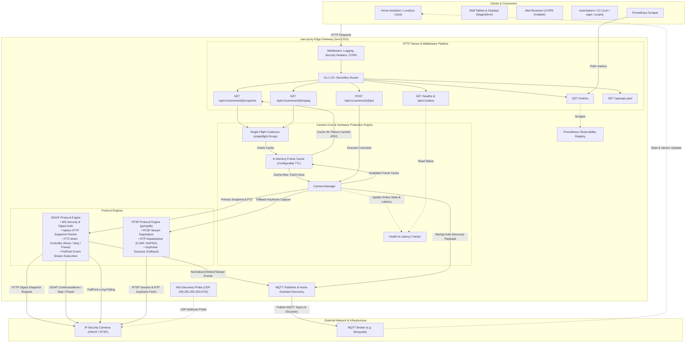
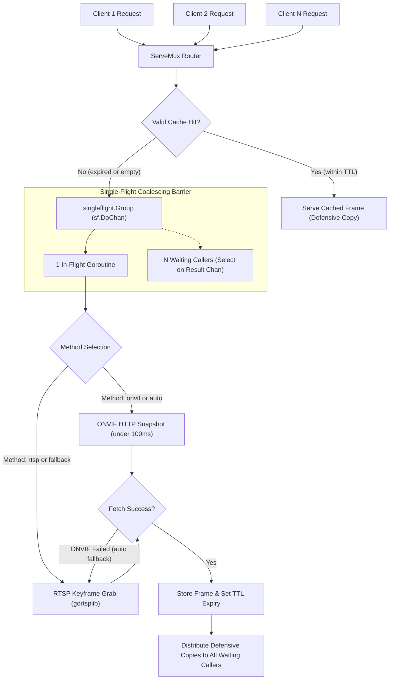

# cam-proxy Architecture

This document details the internal architecture, protocol engines, hardware protection mechanisms, and data flows of `cam-proxy`.

---

## 1. High-Level Gateway Architecture

`cam-proxy` acts as an edge proxy between client applications (Home Assistant, wall dashboards, web browsers, automation scripts) and IP security cameras (ONVIF Profiles S/T and RTSP).

---

## 2. Core Components & Subsystems

### 2.1 HTTP Pipeline & Middleware
- **Routing**: Built on Go 1.22+ standard library `http.ServeMux` using method-prefixed path patterns (`GET /api/v1/cameras/{id}/snapshot`, `GET /api/v1/cameras/{id}/mjpeg`, `POST /api/v1/cameras/{id}/ptz`, `GET /healthz`, `GET /metrics`).
- **Security Headers Middleware**: Enforces `X-Content-Type-Options: nosniff` across all responses. Dynamic image and stream endpoints (`/snapshot`, `/mjpeg`, `/stream`) enforce cache busting headers (`Cache-Control: no-cache, no-store, must-revalidate`, `Pragma: no-cache`, `Expires: 0`).
- **CORS Middleware**: Handles browser preflight `OPTIONS` requests with `204 No Content` and supports configurable allowed origins, methods, headers, and credentials.
- **Structured Logging**: Standard library `log/slog` structured access logger recording method, path, status, remote address, and duration.

### 2.2 Hardware Protection & Caching Subsystem

Budget IP cameras (Tapo, Reolink, Hikvision, Dahua, Amcrest) have constrained hardware with limited concurrent socket connections. `cam-proxy` protects cameras from connection storms using a two-stage concurrency barrier:

1. **In-Memory TTL Frame Cache**:
   - Stores the most recent JPEG frame in memory.
   - Configurable short TTL (`cache_ttl`, default: `500ms`, `0` to disable).
   - Any request arriving within the TTL is served directly from RAM without touching the camera.
   - **Defensive Copying**: Any frame returned from cache or `singleflight` is copied (`copy(dest, src)`) to prevent data race conditions between concurrent HTTP response writers.

2. **Single-Flight Request Coalescing (`golang.org/x/sync/singleflight`)**:
   - When the cache expires, multiple concurrent requests for the same camera are collapsed into a single camera request via `sf.DoChan(key, ...)`.
   - If 20 browser tabs or dashboard tiles request a snapshot simultaneously, only 1 request connects to the camera hardware.
   - **Context Isolation**: Callers select on their own request `ctx.Done()` alongside the singleflight result channel. If a client aborts or times out, their context cancels cleanly without terminating the shared in-flight hardware fetch, ensuring remaining callers receive their frame.

3. **PTZ Motor Invalidation**:
   - Any camera movement alters the field of view.
   - Invoking `PTZMove`, `PTZStop`, or `PTZPreset` immediately triggers `Camera.InvalidateCache()`.
   - Cache invalidation increments the internal cache generation counter, clears the timestamp, and forces the subsequent snapshot request to fetch a fresh post-movement frame.

### 2.3 Protocol Engines

#### ONVIF Protocol Engine
- **WS-Security & Digest Authentication**: Implements ONVIF Profile S and T SOAP envelopes, generating `UsernameToken` headers with nonce, creation timestamp, and SHA-1 password digests.
- **Fast HTTP Snapshot Capture**: Queries the ONVIF Media Service (`GetSnapshotUri`), resolves the direct HTTP endpoint, and performs authenticated HTTP Digest GET requests. Delivers snapshots in under 100ms.
- **PTZ Motor Control**: Issues continuous velocity move vectors (`ContinuousMove`), motorized halts (`Stop`), and preset viewpoints (`GotoPreset`).
- **PullPoint Event Polling**: Subscribes to ONVIF PullPoint event queues via long-polling, parsing notification envelopes for motion detection, tampering alerts, and line-crossing events.

#### RTSP Protocol Engine
- **Zero-CGO Pure Go Implementation**: Powered by `github.com/bluenviron/gortsplib/v5` and `github.com/pion/rtp`.
- **Keyframe Extraction**: Connects via TCP RTSP, depacketizes RTP payloads (H.264 / MJPEG), locates keyframe (IDR/SPS/PPS) boundaries, and captures complete image frames.
- **Automatic Fallback**: Used automatically when cameras do not provide native ONVIF snapshot URIs or when HTTP snapshot requests return errors.

### 2.4 Event Bridge & Home Assistant MQTT Auto-Discovery
- **Event Normalization**: Transforms vendor-specific ONVIF SOAP notification topics into uniform JSON event payloads:
  - Topic: `<topic_prefix>/<camera_id>/<event_type>` (e.g. `cam-proxy/events/driveway/motion`)
  - Types: `motion`, `tamper`, `line_cross`
- **Home Assistant Auto-Discovery**:
  - Published automatically on gateway startup when `discovery: true`.
  - Topics: `homeassistant/binary_sensor/cam_proxy_<camera_id>_<event_type>/config`
  - Payloads include device classes, icon definitions, unique IDs, and device registry metadata linking all entities under the camera hardware profile.
  - Published with `retained: true` and QoS 1 to survive broker restarts.

### 2.5 Discovery Engine
- **WS-Discovery**: Sends multicast UDP probe envelopes to `239.255.255.250:3702` (WS-Discovery) to discover active ONVIF devices on the local subnet.
- **Port Sweeper**: Probes common streaming ports (554, 8554, 2020, 80) to detect RTSP endpoints.
- **Config Generator**: Translates discovered probe responses into valid YAML configuration snippets ready for `cam-proxy.yaml`.

### 2.6 Observability Subsystem
- **Prometheus Metrics Exporter**: Available at `GET /metrics`.
  - `cam_proxy_snapshots_total{camera_id, status, source}`: Tracks snapshot volume segmented by source (`cache` vs `hardware`) and status (`success` vs `error`).
  - `cam_proxy_snapshot_duration_seconds`: Histogram observing hardware snapshot response latency.
  - `cam_proxy_camera_online{camera_id}`: Gauge tracking device reachability (1 = online, 0 = offline).
  - `cam_proxy_mqtt_events_total{camera_id, status}`: Counter of processed and published event alerts.
- **Health & Status REST API**: Available at `GET /healthz` and `GET /api/v1/status`, providing real-time camera connectivity states, last error messages, and snapshot latency benchmarks.

---

## 3. Resource & Memory Footprint Strategy

`cam-proxy` is engineered for resource-constrained edge appliances such as Raspberry Pi Zero/3/4/5, NAS containers, and edge routers:

| Metric | cam-proxy | Full NVR (Frigate, Blue Iris) | Video Streaming Server (go2rtc) |
| :--- | :--- | :--- | :--- |
| **Idle Memory (RSS)** | **~10–15 MB** | 500 MB – 4+ GB | 50 MB – 200 MB |
| **Idle CPU Utilization** | **~0%** | 20% – 80% (constant decoding/AI) | 1% – 5% |
| **Video Decoding** | On-demand keyframe only | Continuous 24/7 decoding | Continuous passthrough/demuxing |
| **Binary Size** | **~15 MB** (Single static binary) | Heavy container image (> 1 GB) | ~30 MB |
| **Native Dependencies** | **None** (Zero CGO) | Python, OpenCV, FFmpeg, CUDA | Go / CGO |

### Ephemeral Allocations
Instead of keeping persistent video decoding pipelines running in background goroutines, `cam-proxy` uses ephemeral snapshot extraction:
1. Sockets are opened only when a snapshot or PTZ action is requested (unless cached).
2. The JPEG byte slice is captured, written to the in-memory cache, and served to clients.
3. Socket connections close immediately upon transfer completion.
4. Temporary frame buffers are swiftly reclaimed by the Go garbage collector.
